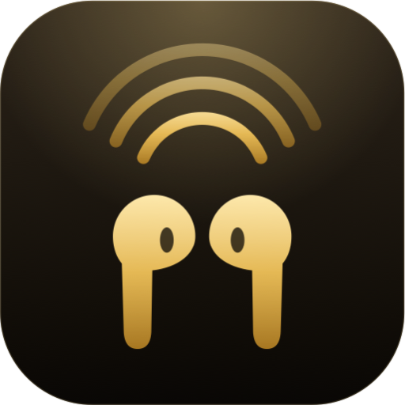
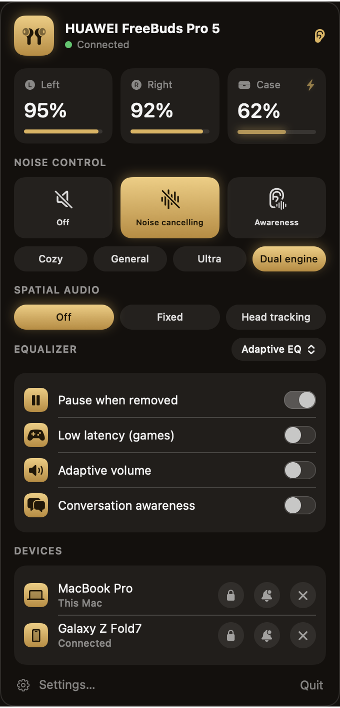
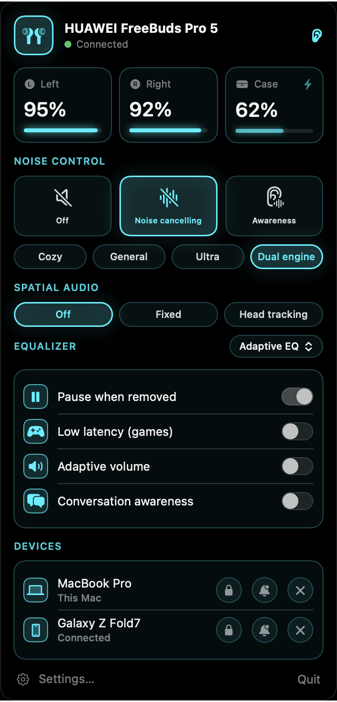
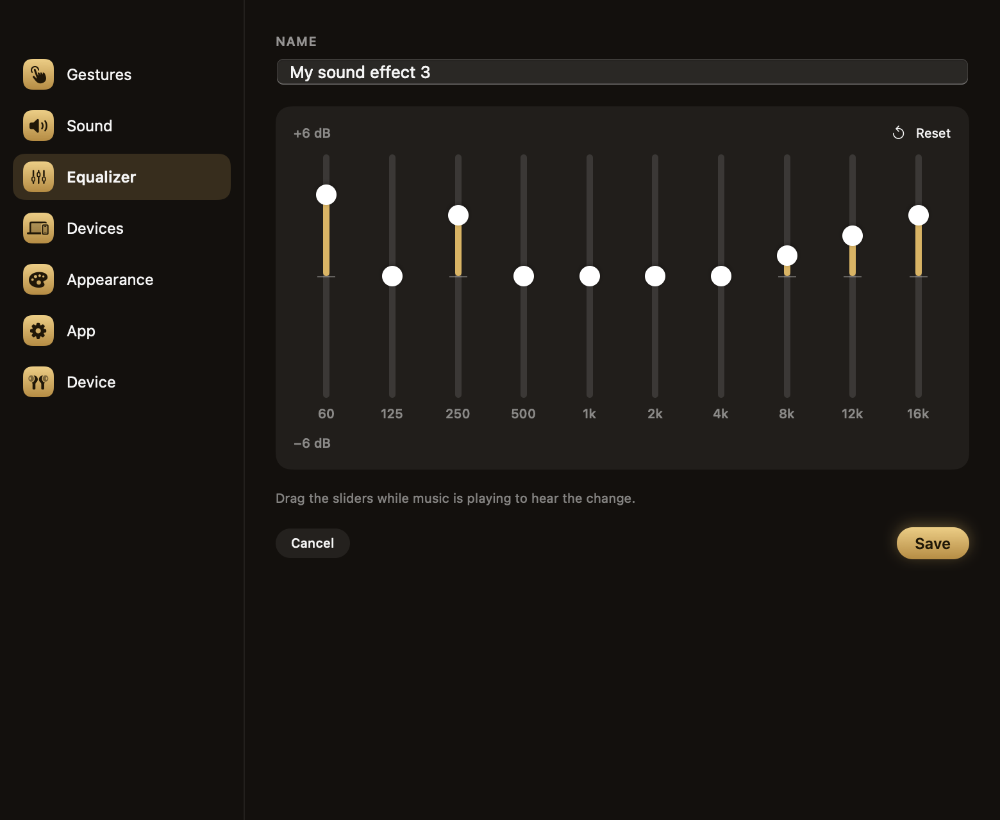
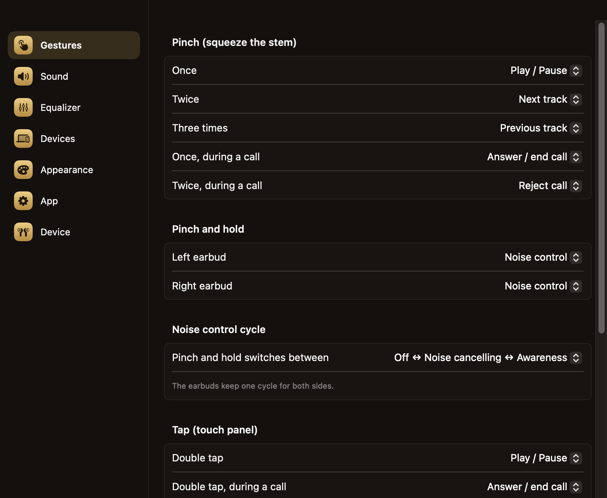

<p align="center">
  
</p>

<h1 align="center">Free Buds Manager</h1>

<p align="center">
  <a href="https://github.com/edufigueiredos/free-buds-manager/actions/workflows/ci.yml"></a>
  <a href="LICENSE"></a>
  
</p>

> Every section is written twice: **English** first, then **Português (Brasil)** in a block you can collapse.
> Cada seção está escrita duas vezes: **inglês** primeiro, depois **português (Brasil)** em um bloco que pode ser recolhido.

---

## What it is · O que é

A native, unofficial menu-bar app for macOS that controls **Huawei FreeBuds** — the settings the Huawei app only
offers on phones: noise control, spatial audio, equalizer, gestures, multi-device connection and more. No Python, no
Electron: Swift and SwiftUI, talking to the earbuds over Bluetooth.

> Made for the **FreeBuds Pro 5** and tested only on it (firmware 5.4.12, macOS 27, **Apple Silicon Mac**). Other
> FreeBuds models speak a very similar protocol and may partly work, but nobody has tried yet.

<details open>
<summary>🇧🇷 Português</summary>

Um app nativo, não oficial, para a barra de menus do macOS que controla os **fones Huawei FreeBuds**: os ajustes que o
app da Huawei só oferece no celular. Controle de ruído, áudio espacial, equalizador, gestos, conexão com vários
dispositivos e mais. Sem Python, sem Electron: Swift e SwiftUI, conversando com o fone por Bluetooth.

> Feito para o **FreeBuds Pro 5** e testado somente nele (firmware 5.4.12, macOS 27, Apple Silicon). Outros
> modelos FreeBuds usam um protocolo muito parecido e podem funcionar em parte, mas ninguém testou ainda.

</details>

## Platform support · Plataformas

| Platform · Plataforma | Status |
|---|---|
| macOS on **Apple Silicon** (M1 and later) · macOS em **Apple Silicon** (M1 em diante) | ✅ **Works** · **Funciona** |
| macOS on Intel · macOS em Intel | ❓ **Unknown** — the build contains an Intel part, but it was never tested · **Desconhecido** — a build tem uma parte para Intel, mas nunca foi testada |
| Windows | 🔜 Coming soon · Em breve |
| Linux | 🔜 Coming soon · Em breve |

For now, **Free Buds Manager only works on Apple Silicon Macs** (tested on macOS 27). Windows and Linux versions are planned.

<details open>
<summary>🇧🇷 Português</summary>

Por enquanto, o **Free Buds Manager só funciona em Macs com Apple Silicon** (testado no macOS 27). Versões para Windows e
Linux estão planejadas.

</details>

## Screenshots · Capturas de tela

| Quick panel · Painel rápido | Neon theme · Tema Neon |
|:---:|:---:|
|  |  |

| Equalizer editor · Editor de equalizador | Gestures · Gestos |
|:---:|:---:|
|  |  |

*Rendered from the app's real SwiftUI views with sample data. The Liquid Glass theme can only be seen on a real
screen, so it has no image here.*

<details open>
<summary>🇧🇷 Português</summary>

*Imagens geradas a partir das telas reais do app, com dados de exemplo. O tema Liquid Glass só aparece numa tela de
verdade, por isso não tem imagem aqui.*

</details>

## Features · Recursos

| English | Português |
|---|---|
| Battery of each earbud and of the case, with charging state | Bateria de cada fone e do estojo, com o estado de carga |
| Noise control: off, cancelling (cozy, general, ultra, dual engine) and awareness (standard, voice, adaptive with intensity) | Controle de ruído: desligado, cancelamento (aconchegante, geral, ultra, mecanismo duplo) e transparência (padrão, voz, adaptável com intensidade) |
| Follows changes made by touching the earbuds | Acompanha mudanças feitas tocando nos fones |
| Spatial audio: off, fixed, head tracking | Áudio espacial: desligado, fixo, acompanhamento da cabeça |
| Equalizer presets and **custom profiles** (10 bands, saved in the earbuds) | Predefinições de equalizador e **perfis personalizados** (10 bandas, salvos no fone) |
| Gestures: pinch, tap, press and hold, pinch and hold, swipe, noise-control cycle | Gestos: pinça, toque, pressionar e segurar, pinçar e segurar, deslizar, ciclo do controle de ruído |
| **Multi-connection:** connect or release each device, audio and voice priority | **Multi-conexão:** conectar ou liberar cada dispositivo, prioridade de áudio e de voz |
| **Pause when removed on the Mac:** pauses the music when an earbud comes out, resumes when one goes back in | **Pausar ao remover, no Mac:** pausa a música quando um fone sai e retoma quando um volta |
| Adaptive volume, conversation awareness, one-earbud cancelling, head control, low latency, sound preference | Volume adaptável, reconhecimento de conversa, cancelamento com um fone, controle de cabeça, baixa latência, preferência de som |
| Charging-case tone and case opening tone | Tom do estojo e tom de abertura do estojo |
| Five themes: Gold, Black, White, Neon (any color, pure black for OLED), Liquid Glass (macOS 26+), plus Classic | Cinco temas: Dourado, Preto, Branco, Neon (qualquer cor, preto puro para OLED), Liquid Glass (macOS 26+) e Clássico |
| English and Brazilian Portuguese | Inglês e português do Brasil |

Not included on purpose: fit test (plays audio), *find my earbuds* (makes them beep), firmware update.
· Não incluídos de propósito: teste de ajuste (toca áudio), *encontrar fones* (faz apitar) e atualização de firmware.

## Install · Instalação

> Requires a Mac with **Apple Silicon**. Intel Macs are untested.

1. Download `FreeBudsManager-x.y.z.dmg` from [Releases](https://github.com/edufigueiredos/free-buds-manager/releases), open it
   and drag the app to **Applications**.
2. Open it and allow **Bluetooth** when macOS asks. The icon appears in the menu bar.
3. Pair the earbuds first in *System Settings › Bluetooth*.

The app is **not notarized** (that needs a paid Apple developer account). If macOS blocks it, or offers to "install this
app" and then says it could not, drag the app to Applications yourself and run this once in Terminal:

```bash
xattr -dr com.apple.quarantine "/Applications/Free Buds Manager.app"
```

<details open>
<summary>🇧🇷 Português</summary>

> Exige um Mac com **Apple Silicon**. Macs Intel não foram testados.

1. Baixe o `FreeBudsManager-x.y.z.dmg` em [Releases](https://github.com/edufigueiredos/free-buds-manager/releases), abra-o
   e arraste o app para **Aplicativos**.
2. Abra o app e permita o **Bluetooth** quando o macOS pedir. O ícone aparece na barra de menus.
3. Pareie os fones antes em *Ajustes do Sistema › Bluetooth*.

O app **não é notarizado** (isso exige uma conta paga de desenvolvedor da Apple). Se o macOS bloquear, ou oferecer
"instalar este app" e depois disser que não conseguiu, arraste o app para Aplicativos você mesmo e rode isto uma vez no
Terminal:

```bash
xattr -dr com.apple.quarantine "/Applications/Free Buds Manager.app"
```

</details>

## Permissions · Permissões

**Bluetooth** is needed to talk to the earbuds. *Pause when removed* needs one more permission, depending on what is
playing: **Automation** (macOS asks the first time) lets the app tell **Music** and **Spotify** to pause and play by name,
and **Accessibility** lets it press the Play/Pause key for everything else, such as a browser tab. The earbuds do not tell
the Mac to pause, so the app does it itself. It only resumes music that it paused, and it ignores call apps (Teams, Zoom,
FaceTime, Webex).

macOS ties a permission to the exact build of an app. Because this app is not signed with a paid certificate, **after an
update the switch in System Settings can look on while it no longer applies**. Press **Allow** in the app: it clears the
old entry (only its own) and asks again; then switch the app on in the list. Opening and closing the *same* build does not
ask again.

<details open>
<summary>🇧🇷 Português</summary>

O **Bluetooth** é necessário para falar com os fones. O *Pausar ao remover* precisa de mais uma permissão, conforme o
que estiver tocando: a **Automação** (o macOS pergunta na primeira vez) deixa o app mandar o **Music** e o **Spotify**
pausarem e tocarem pelo nome, e a **Acessibilidade** deixa o app apertar a tecla Play/Pause para todo o resto, como uma
aba do navegador. O fone não manda o Mac pausar, então o app faz isso por conta própria. Ele só retoma a música que ele
mesmo pausou e ignora apps de chamada (Teams, Zoom, FaceTime, Webex).

O macOS prende a permissão à build exata de um app. Como este app não é assinado com certificado pago, **depois de uma
atualização a chave em Ajustes do Sistema pode parecer ligada e já não valer**. Clique em **Permitir** no app: ele apaga
a entrada antiga (só a dele) e pede de novo; depois ligue o app na lista. Abrir e fechar a *mesma* build não pede de novo.

</details>

## Troubleshooting · Solução de problemas

**"Connected, not answering."** The earbuds talk to one control session at a time. If an app left its session without
closing it (a crash, a force quit), they ignore the next one until they are reset. Close and reopen the case, or close the
Huawei app on your phone, then press **Try again**. The app closes its channel properly when you quit, so quitting
normally avoids this.

**Diagnostic log.** If something does not work (for example, music does not pause or resume), open **Settings › App**,
turn on **Record a diagnostic log**, repeat the problem, then press **Copy log** and paste it into an issue. The log keeps
what the app saw and decided: earbuds in or out, which apps were making sound, whether the pause worked, and the
permissions. It does not record Bluetooth addresses, the names of other devices or what you play. It is off by default,
lives in `~/Library/Logs/Free Buds Manager/`, and rotates at 1 MB.

**Logs.** `log stream --info --predicate 'subsystem == "io.github.edufigueiredos.FreeBudsManager"'` shows what the app sends
and receives.

<details open>
<summary>🇧🇷 Português</summary>

**"Conectado, sem responder".** O fone atende uma sessão de controle por vez. Se um app saiu da sessão sem fechá-la
(travamento, encerramento forçado), ele ignora a próxima até ser reiniciado. Feche e abra o estojo, ou feche o app da
Huawei no celular, e clique em **Tentar de novo**. O app fecha o canal direito quando você sai, então sair normalmente
evita isso.

**Registro de diagnóstico.** Se algo não funciona (por exemplo, a música não pausa ou não retoma), abra **Ajustes › App**,
ligue **Gravar um registro de diagnóstico**, repita o problema, clique em **Copiar registro** e cole numa issue. O registro
guarda o que o app viu e decidiu: fones na orelha ou fora, quais apps estavam tocando, se a pausa funcionou e as
permissões. Não grava endereços Bluetooth, nomes de outros dispositivos nem o que você toca. Vem desligado, fica em
`~/Library/Logs/Free Buds Manager/` e gira em 1 MB.

**Logs.** `log stream --info --predicate 'subsystem == "io.github.edufigueiredos.FreeBudsManager"'` mostra o que o app
envia e recebe.

</details>

## How it works · Como funciona

The earbuds expose a proprietary control channel over Bluetooth RFCOMM. Every command in this app was captured from the
official Huawei app talking to a FreeBuds Pro 5, and the test suite checks that this project produces the same bytes. The
frame format and the full command list are in [docs/PROTOCOL.md](docs/PROTOCOL.md).

<details open>
<summary>🇧🇷 Português</summary>

O fone expõe um canal de controle próprio sobre Bluetooth RFCOMM. Cada comando deste app foi capturado do app oficial da
Huawei conversando com um FreeBuds Pro 5, e os testes conferem que este projeto gera os mesmos bytes. O formato dos
pacotes e a lista completa de comandos estão em [docs/PROTOCOL.md](docs/PROTOCOL.md).

</details>

## Build from source · Compilar

Needs Xcode 26 or later (the Liquid Glass theme uses the macOS 26 SDK; the app still runs on macOS 14+).

```bash
swift test                 # protocol tests
scripts/build-app.sh       # -> build/Free Buds Manager.app (universal, ad-hoc signed)
scripts/make-dmg.sh        # -> dist/FreeBudsManager-<version>.dmg
scripts/preview.sh         # renders the screens to build/preview/*.png with sample data
```

`swift run` is not enough: the app needs its `Info.plist` for the Bluetooth permission, so use the scripts. To sign with a
real certificate: `SIGN_IDENTITY="Developer ID Application: …" scripts/build-app.sh`.

<details open>
<summary>🇧🇷 Português</summary>

Precisa do Xcode 26 ou superior (o tema Liquid Glass usa o SDK do macOS 26; o app continua rodando no macOS 14+).

```bash
swift test                 # testes do protocolo
scripts/build-app.sh       # -> build/Free Buds Manager.app (universal, assinatura ad-hoc)
scripts/make-dmg.sh        # -> dist/FreeBudsManager-<versão>.dmg
scripts/preview.sh         # gera as telas em build/preview/*.png com dados de exemplo
```

`swift run` não basta: o app precisa do `Info.plist` para a permissão de Bluetooth, então use os scripts. Para assinar com
um certificado de verdade: `SIGN_IDENTITY="Developer ID Application: …" scripts/build-app.sh`.

</details>

## Contributing · Contribuindo

Other models, or features that are still undecoded (see the end of [docs/PROTOCOL.md](docs/PROTOCOL.md)), need a capture
of the official app: enable *Bluetooth HCI snoop log* on an Android phone, change one setting in Huawei AI Life, and open
an issue with the log.

<details open>
<summary>🇧🇷 Português</summary>

Outros modelos, ou recursos ainda não decifrados (veja o fim de [docs/PROTOCOL.md](docs/PROTOCOL.md)), precisam de uma
captura do app oficial: ative o *registro de rastreamento HCI do Bluetooth* num celular Android, mude uma configuração no
Huawei AI Life e abra uma issue com o log.

</details>

## Credits and disclaimer · Créditos e aviso

Free Buds Manager is **unofficial** and not affiliated with or endorsed by Huawei. "Huawei" and "FreeBuds" belong to their
owners. The protocol was first mapped by [OpenFreebuds](https://github.com/melianmiko/OpenFreebuds) (GPL-3.0); this project
is an independent implementation, written from observed traffic and not derived from its code.

<details open>
<summary>🇧🇷 Português</summary>

O Free Buds Manager é **não oficial** e não tem vínculo com a Huawei nem é aprovado por ela. "Huawei" e "FreeBuds"
pertencem aos seus donos. O protocolo foi mapeado primeiro pelo [OpenFreebuds](https://github.com/melianmiko/OpenFreebuds)
(GPL-3.0); este projeto é uma implementação independente, escrita a partir de tráfego observado e não derivada do código
dele.

</details>

## License · Licença

[MIT](LICENSE) © 2026 Eduardo Figueiredo dos Santos
